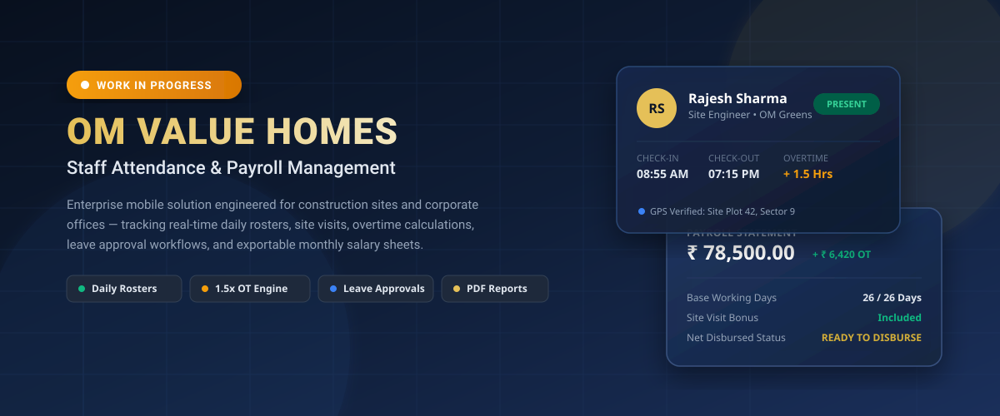

# OM Value Homes — Staff Attendance & Payroll Management System

<div align="center">



[](#work-in-progress-roadmap)
[-navy?style=for-the-badge&logo=android&logoColor=white)](#technical-architecture)
[-teal?style=for-the-badge&logo=jetpackcompose&logoColor=white)](#technical-architecture)
[-blue?style=for-the-badge&logo=sqlite&logoColor=white)](#data-storage--persistence)

</div>

---

> ### ⚠️ Work in Progress Notice
> **This application is actively under development.** Features, schema definitions, and internal calculation models are subject to enhancements. Core local offline workflows (Attendance, Overtime, Leave Approvals, and Payroll) are functional, with advanced enterprise modules scheduled for upcoming releases.

---

## 🏗️ Project Overview

**OM Value Homes** is a specialized workforce and payroll management Android application tailored for real estate developers, building contractors, and on-site construction managers. 

In the real estate and construction industry, workforces span multiple project sites, departments (Site Engineering, Architecture, Sales, Construction Labor, Accounts), and variable working conditions. This app eliminates paper punch-cards and manual registers by providing a fast, offline-first mobile system with:

- **Daily Attendance Rosters**: One-tap check-in, check-out, half-day, and site-visit logging with geolocation stamps.
- **Automated Overtime (OT) Engine**: Accurately accounts for extended site hours using a standardized 1.5x hourly rate calculation.
- **Leave Request & Approval Desk**: Multi-type leave requests (Casual, Sick, Earned, Unpaid) with admin approval queues.
- **Monthly Payroll Computation**: Automatic deduction of PF/ESI, professional taxes, and dynamic addition of earned OT.
- **Instant PDF Statements**: Generate and share formatted monthly attendance and salary reports directly from the device.
- **Clean Mock Data Lifecycle**: One-click wipe of demo records for fresh production onboarding or demo restore.

---

## 📸 Application Preview & Visual Identity

The interface adheres strictly to **Material Design 3 (M3)** with custom luxury corporate branding:
- **Navy Palette (`#0D1B2A`, `#1B263B`)**: Professional, authoritative foundation fitting enterprise administration.
- **Warm Gold Accents (`#D4AF37`, `#F3E7BE`)**: Reflects quality, stability, and high-value property development.
- **Emerald Green (`#10B981`) & Amber (`#F59E0B`)**: High-contrast status indicators for quick visual scanning on sunny construction sites.

---

## ⚡ Key Modules & Features

### 1. 👥 Staff Directory & Team Rostering
- Multi-department staff indexing across:
  - **Site Engineering** (Project Leads, Site Supervisors)
  - **Architecture & Design** (3D Modelers, Draftsmen)
  - **Construction & Labor** (Foremen, Electricians, Plumbers)
  - **Sales & Marketing** (Property Consultants, CRM Specialists)
  - **Accounts & Admin** (HR, Billing Executives)
- Employee profiles include designation, phone, email, base monthly salary, and bank account details.
- Comprehensive search and quick-filter bar.

### 2. ⏱️ Daily Attendance Tracking & Geolocation
- Date-by-date roster overview with live attendance statistics (Present, Late, Half Day, Absent, On Leave).
- Status toggles:
  - **Present (Full Day)**
  - **Half Day** (4 hours)
  - **Absent**
  - **Paid Leave**
  - **Site Visit** (External property plot inspection)
- Precise time stamping for punch-in and punch-out.
- Optional GPS latitude/longitude capture for on-site verification.

### 3. ⏳ Overtime (OT) Management
- Real-time logging of additional site working hours.
- Automatic rate computation using the standard formula:
  $$\text{Hourly Rate} = \frac{\text{Monthly Base Salary}}{26 \times 8}$$
  $$\text{OT Earning} = \text{OT Hours} \times (\text{Hourly Rate} \times 1.5)$$
- Prevents manual calculation errors between site engineers and accounts.

### 4. 📝 Leave Management & Approval Pipeline
- Staff leave requests categorized by **Casual Leave (CL)**, **Sick Leave (SL)**, **Earned Leave (EL)**, and **Loss of Pay (LOP)**.
- Color-coded status queues: `PENDING`, `APPROVED`, `REJECTED`.
- Management remarks and supervisor review timestamps.

### 5. 💰 Automated Monthly Payroll Engine
- Monthly salary calculation based on real recorded working days.
- Detailed breakdown:
  - **Gross Salary**: Base + Total Overtime Earnings
  - **Statutory Deductions**: Provident Fund (PF), ESI, Professional Tax (PT)
  - **Net Payable Salary**: Formatted in Indian Rupee currency (₹)
- Individual employee payroll slips and aggregate company expense summaries.

### 6. 📄 Native PDF Export & Sharing
- High-fidelity PDF report generation via Android's native `PdfDocument` engine.
- Formatted tabular data with company header, branding, date range, and signature lines.
- Native Android `Intent.ACTION_SEND` integration for sharing via WhatsApp, Email, Google Drive, or Bluetooth.

### 7. 🧹 Mock Data Reset & Demo Sandbox
- **Clear Mock Data**: Safety-confirmed wipe of all seed records (staff, punch logs, leaves) to prepare the app for clean company data entry.
- **Restore Sample Data**: One-tap recreation of realistic site data for training and demonstration purposes.

---

## 🚧 Work in Progress Roadmap

The development team is actively executing against the following phase milestones:

| Phase | Feature / Capability | Status | Target Timeline |
| :--- | :--- | :---: | :--- |
| **Phase 1** | Room Local Database & Offline-First Core Architecture | **Completed** | Q3 2026 |
| **Phase 1** | Daily Attendance & 1.5x Overtime Calculation Engine | **Completed** | Q3 2026 |
| **Phase 1** | Leave Approval Queue & Status Management | **Completed** | Q3 2026 |
| **Phase 1** | PDF Document Generation & Android Share Integration | **Completed** | Q3 2026 |
| **Phase 1** | Mock Data Lifecycle Controls (Clear / Reload) | **Completed** | Q3 2026 |
| **Phase 2** | **Geo-fencing Radius Verification** (Enforce punch-in only within 100m of project perimeter) | 🔨 *In Progress* | Q4 2026 |
| **Phase 2** | **Biometric Fingerprint & Face Unlock** for supervisor authentication | 🔨 *In Progress* | Q4 2026 |
| **Phase 2** | **WhatsApp Automated Salary Slip Delivery** via direct deep-link | 🔨 *In Progress* | Q4 2026 |
| **Phase 3** | **Cloud Synchronization & Multi-Site Admin Portal** | 📋 *Planned* | Q1 2027 |
| **Phase 3** | **Contractor Piece-Rate Wage Modules** for external sub-contractors | 📋 *Planned* | Q1 2027 |

---

## 🛠️ Technical Architecture

- **Language**: 100% Modern Kotlin
- **UI Toolkit**: Jetpack Compose with Material 3 theming (`MaterialTheme.colorScheme`)
- **Architecture**: MVVM (Model-View-ViewModel) with unidirectional data flow
- **State Management**: Kotlin Coroutines & `StateFlow` / `collectAsStateWithLifecycle`
- **Persistence**: Android Room 2.6+ with SQLite, TypeConverters, and DAO flows
- **Document Engine**: Android Native Graphics & `android.graphics.pdf.PdfDocument`
- **Testing**: Robolectric JVM unit tests and Roborazzi visual regression tests

```
app/src/main/java/com/example/
├── data/
│   ├── dao/             # StaffDao, AttendanceDao, LeaveDao
│   ├── database/        # AppDatabase, Converters
│   ├── model/           # StaffMember, AttendanceRecord, LeaveRequest, PayrollSummary
│   ├── repository/      # AttendanceRepository (Single Source of Truth)
│   └── seed/            # SeedData (Sample data for quick onboarding)
├── ui/
│   ├── screens/         # StaffDirectory, Attendance, Overtime, LeaveApproval, Payroll
│   ├── theme/           # Color, Theme, Type (OM Value Homes Branding)
│   ├── util/            # PdfExportHelper
│   └── viewmodel/       # AttendanceViewModel
└── MainActivity.kt      # Main Entry Point & Tab Navigation
```

---

## 🚀 Getting Started & Build Instructions

### Prerequisites
- Android Studio Ladybug (2024.2.1+) or newer
- JDK 17 or JDK 21
- Android SDK with `minSdk = 26` and `targetSdk = 36`

### Running the App
1. Open the project in Google AI Studio or Android Studio.
2. Allow Gradle to sync dependencies from `libs.versions.toml`.
3. Select an emulator or connected physical Android device.
4. Run:
   ```bash
   gradle :app:installDebug
   ```

### Running Unit Tests
To execute all local JVM and Room database verification tests:
```bash
gradle :app:testDebugUnitTest
```

---

## 🔒 Security & Privacy

- **Zero Broad Storage Access**: The application utilizes private app-scoped directories and Android `FileProvider` for secure PDF sharing without requesting invasive storage permissions (`READ_EXTERNAL_STORAGE`).
- **Offline-First Data Isolation**: All employee records, bank account information, and daily punch timestamps reside safely in the device's local encrypted SQLite container.

---

<div align="center">
<sub>© 2026 OM Value Homes Pvt. Ltd. • Workforce &amp; Real Estate Solutions • All Rights Reserved</sub>
</div>
